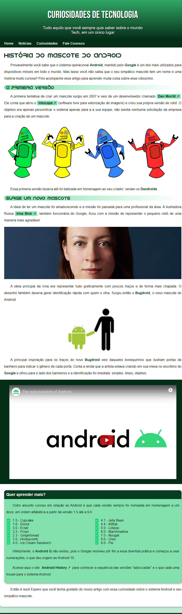

#   Primeiro_projeto_site 

<!-- 

 
 <h2>Clique aqui para visualizar o projeto</h2>

 -->

  <h2>Meu primeiro projeto de uma página de um site responsivo feito como um desafio durante meus estudos de HTML e CSS</h2>
  
  - Projeto desenvolvido durante o curso de HTML e CSS do Curso em Vídeo.
  
  - Esse mini projeto serviu como meio de aplicar os conhecimentos adquiridos durante o curso.

---

<h2>Conhecimentos aplicados nesse projeto:</h2>

- Formatação de textos em HTML
- Utilização de links 
- Utilização de listas
- Estilos em CSS
- Psicologia das cores 
- Tipografia
- Aplicação de IDs, classes, pseudoclasses e pseudoelementos em CSS
- Grouping tags em HTML5
- Sombras em caixas
- Responsividade 
- Box-model

---

<h2>Resultado do Projeto</h2>

